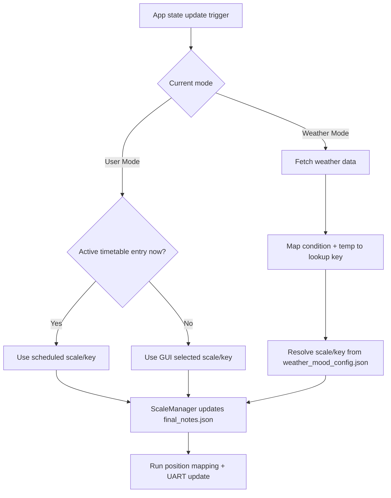
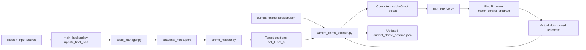
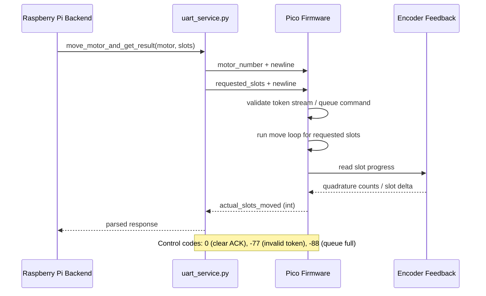

# MSD Data Sonification Windchime

A full-stack physical-computing project that translates musical state (selected by user or weather mapping) into real motorized Geneva-mechanism chime positions.

## Project Summary

This system connects:

- GUI-driven mode/scale selection
- Weather API data
- Music-to-note mapping logic
- Note-to-mechanism mapping
- Raspberry Pi to Pico UART control
- Encoder-feedback motor execution

The result is an adaptive windchime instrument whose physical note layout updates automatically based on either human input or live weather.

## End-to-End Pipeline

1. App decides active control mode (`User Mode` or `Weather Mode`).
2. Backend resolves target scale/key.
3. `ScaleManager` writes active note-state to `data/final_notes.json`.
4. `ChimeMapper` converts active notes into 8 target Geneva positions.
5. Current physical positions are loaded from `current_chime_position.json`.
6. Slot deltas are computed modulo 6 for each set.
7. Pi sends UART commands to Pico (`motor`, `slots`).
8. Pico executes motor motion with encoder feedback and returns actual moved slots.
9. Pi updates/saves current position state for the next cycle.

## How Mode Selection Works

### User Mode

- Source priority:
  1. Active timetable entry (if current time/date matches)
  2. Manual GUI selection (`selected_scale`, `selected_key`)
- If selected scale is `Custom`, key is not required.

### Weather Mode

- Weather is fetched from OpenWeather.
- Condition + temperature are mapped to a key like `Cloudy_50-75`.
- That key is looked up in `data/weather_mood_config.json`.
- Returned scale/key is applied through the same `ScaleManager` flow as user mode.

## System Diagrams

### Mode Decision Flow



### Backend Data Pipeline



### Pi <-> Pico UART Sequence



## Backend File Guide

### Core orchestration

- `app.py`
  - Main CustomTkinter app.
  - Owns mode state, selected scale/key, weather refresh loop, and triggers backend updates.
- `chime_update.py`
  - Weather refresh path used by app background updates.
  - Chooses timetable override vs weather mapping, then calls full backend update.
- `main_backend.py`
  - Core mode-to-note resolver.
  - Applies user/weather selection into `data/final_notes.json`.
  - Exposes `get_encoder_positions()` via `ChimeMapper`.

### Mapping and state layers

- `scale_manager.py`
  - Loads `data/chime_states.json`.
  - Writes active 16-note booleans to `data/final_notes.json`.
  - Handles keyed scales and `Custom`.
- `weather_mode_mapper.py`
  - Converts OpenWeather payload into condition bucket + temperature bucket.
  - Returns mapped scale/key pair with fallback (`Major`, `C`).
- `chime_mapper.py`
  - Maps final note booleans into 8 Geneva target slots.
  - Each actuator corresponds to a fixed note-pair.
- `current_chime_position.py`
  - Bridge between backend intent and physical hardware.
  - Computes slot moves, runs UART commands, stores updated physical positions.

### Communications and external services

- `uart_service.py`
  - Pi-side UART transport.
  - Sends move commands and parses integer responses.
  - Handles protocol errors (`-77`, `-88`) and clear acknowledgements.
- `services/weather_service.py`
  - Calls OpenWeather current/forecast/AQI endpoints.
  - Normalizes to internal `weather_data` shape used by mapping logic.

### Support / tests

- `test_full_pipeline.py`
  - Scripted integration-style checks for user/weather pipeline behavior.
- `test_weather_mapper.py`
  - Weather mapper and selection experiments.
- `test_script.py`
  - UART smoke test helper.
- `time_helper.py`
  - Placeholder helper file for timetable-related logic extraction.

## UI Frames (Frontend Layer)

The `frames/` directory contains GUI pages for:

- Home and mode selection
- Preset and custom chime configuration
- Timetable configuration/editing
- Weather mood mapping
- Monitoring and manual rotation/debug interfaces

These frames set state used by `app.py`, which then invokes backend update functions.

## Data and Config Files

- `data/chime_states.json`: all musical presets and custom note state.
- `data/final_notes.json`: active 16-note state used for physical mapping.
- `data/weather_mood_config.json`: weather-bucket to scale/key mapping.
- `current_chime_position.json`: persisted physical set positions (1-6).
- `timetable_configs.json`: scheduled user configurations.
- `API_KEYS.env`: OpenWeather API key source (`OPENWEATHERMAP`).

## UART Protocol

### Standard move

Pi -> Pico:
1. `motor_number` (1-8)
2. `requested_slots` (>0)

Pico -> Pi:
- `actual_slots_moved` (integer)

### Control/error codes

- `c` (Pi -> Pico): clear parser + command queue state
- `0` (Pico -> Pi): clear acknowledged
- `-77` (Pico -> Pi): invalid UART token
- `-88` (Pico -> Pi): command queue full

## Pico Motor Firmware Notes

The firmware in `motor_control_program/` is encoder-informed closed-loop slot targeting (not PID).

Current behavior:

- Relative move semantics: "move N from current slot".
- Slot completion uses encoder-derived moved delta.
- Timeout protections:
  - overall move timeout
  - first-edge timeout
  - no-motion timeout after motion begins
- Post-stop settle wait before reporting movement.
- Near-target slowdown is currently disabled for no-load testing (`SLOWDOWN_SLOTS=0`).

## Build / Flash (Pico)

From repo root:

```bash
cd motor_control_program
cd build
ninja
```

Flash generated firmware artifact to Pico via your normal UF2 workflow.

## Troubleshooting Quick Reference

### All commands return `0`

- Likely no encoder edges detected.
- Check encoder wiring, pin mapping, and first-edge/no-motion timeout settings.

### Commands often return `N-1`

- Usually final-slot stall/slowdown issue.
- For no-load tests keep slowdown disabled; under load tune slowdown and no-motion timeout.

### Random large negative return (example `-19`)

- Encoder glitch/noise or reverse counting event.
- Inspect affected encoder channel and consider rejecting impossible values before state save.

### Frequent `-77`

- UART token stream malformed or desynchronized.
- Ensure newline-delimited integer messages and use clear command to resync.

### Frequent `-88`

- Pico queue saturation from burst traffic.
- Slow command dispatch and wait for response completion before sending more.

## Portfolio Talking Points

- Cross-domain integration: GUI + cloud weather API + embedded firmware + mechatronics.
- Stateful cyber-physical control loop with persistent position tracking.
- Real-time protocol design with error handling and recovery paths.
- Practical reliability engineering: timeout strategy, parser hardening, troubleshooting instrumentation.
